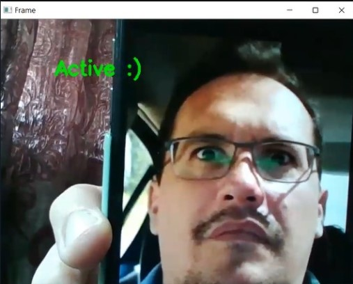
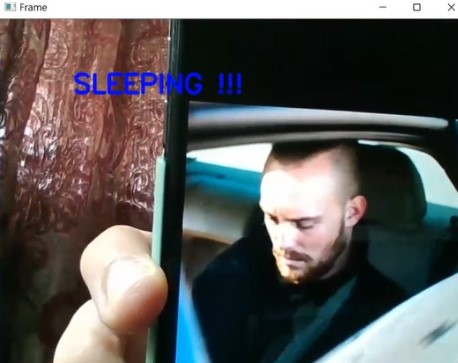

<h2>The Problem</h2>
Distracted driving is a common problem that has resulted in fatalities and injuries. Phones are the most common source of distraction for drivers, 
and texting while driving is extremely common among teenagers. 

<h2>Our solution</h2> 
Our Driver Attention System that employs computer vision to assess a driver's alertness while on the road by tracking their eye movements. 
When their current status is inadequate for a safe trip, they are warned by a beep sound.We want to expand on this effort by utilising machine learning to identify abnormal steering behaviours that indicate weary or inattentive driving. 
The steering wheel would display alerts that were linked to the vehicle's software components. Depending on the driver's condition, neighbouring rest spots or brightly illuminated sites would be recommended, which a GPS tracking device may assist them in reaching. We hope to make a difference and offer a realistic answer to the problem of distracted driving, which is all too common.

<h2>Outputs</h2>

   

<h2>Demo</h2>
A video demonstration of our solution: 
<iframe width="420" height="315"
src="https://www.youtube.com/watch?v=gR9bU3RjHF8&ab_channel=AnanyaMahishi">
</iframe>

<h2>To download the dataset :</h2>

[shape_predictor_68_face_landmarks.dat](https://www.kaggle.com/datasets/sergiovirahonda/shape-predictor-68-face-landmarksdat?resource=download&select=shape_predictor_68_face_landmarks.dat)
